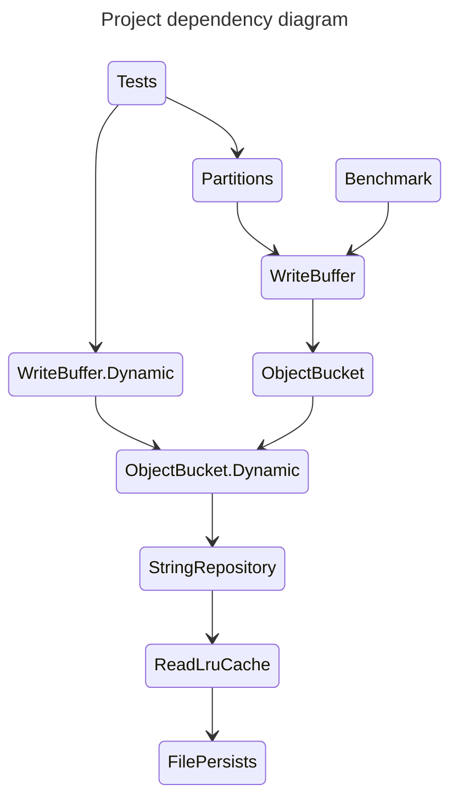

# Aiursoft ArrayDb

[](https://gitlab.aiursoft.com/aiursoft/arraydb/-/blob/master/LICENSE)
[](https://gitlab.aiursoft.com/aiursoft/arraydb/-/pipelines)
[](https://gitlab.aiursoft.com/aiursoft/arraydb/-/pipelines)
[](https://www.nuget.org/packages/Aiursoft.ArrayDb.Partitions/)
[](https://manhours.aiursoft.com/r/gitlab.aiursoft.com/aiursoft/arraydb.html)

Aiursoft ArrayDb is a lightweight, efficient database engine optimized for storing fixed-length data with constant-time indexing performance (O(1)). ArrayDb is ideal for scenarios where fast, reliable storage and access to time-sequenced or resource-utilization data are essential, making it a strong choice for logging, telemetry, and performance tracking use cases.

## Key Design Principles of ArrayDb

Unlike traditional databases, which can struggle with high-frequency data storage requirements, ArrayDb is purpose-built for append-only, fixed-length data storage. It stores entries as continuous, fixed-length data blocks, optimized for minimal read/write operations, ensuring high performance on both SSDs and HDDs.

The core philosophy is: **solve every performance bottleneck at the layer closest to it, not with brute force at the wrong layer.**

### 1. Append-Only: Trade Constraints for Throughput

```
Traditional database:          ArrayDb:
Random read/write              Append-only
     ↓                              ↓
B-Tree / B+Tree                Sequential file layout
     ↓                              ↓
Random disk seeks (~10ms HDD)  Sequential writes (near hardware limit)
```

By giving up `UPDATE` and `DELETE`, ArrayDb achieves write throughput approaching the raw bandwidth of the underlying disk. This is the same philosophy behind Kafka, ClickHouse, LevelDB, and time-series databases: **immutable append unlocks the full sequential I/O potential of the hardware**.

### 2. Separate String Storage: The Foundation of O(1) Random Access

This is the single most important design decision in ArrayDb. Every object is stored in two files:

```
Fixed-size structure file:   [item0: 64B][item1: 64B][item2: 64B]...
String content file:         [str_content_0][str_content_1][str_content_2]...

Each item stores a pointer:  { string_offset: long, string_length: int }
```

If strings were stored inline, every object would have a different size, making it impossible to locate the Nth item without scanning the entire file (O(N)). By separating strings:

- **Reading item N** = `seek(CountMarkerSize + N × itemSize)` → always **O(1)**, regardless of file size.
- **Bulk sequential reads** = one `seek` + one large `read(N × itemSize)` — a single I/O operation.

### 3. File Pre-allocation + Exponential Growth: Eliminate Filesystem Fragmentation

```csharp
// On creation: pre-allocate 16 MB and fill with zeros
fs.SetLength(initialSizeIfNotExists);
FillFileStream(fs, 0, initialSizeIfNotExists); // force the filesystem to allocate contiguous blocks

// When more space is needed: double until sufficient
while (offset + dataLength > sizeToAdjust)
    sizeToAdjust *= 2;  // 16 MB → 32 MB → 64 MB → 128 MB...
```

`SetLength` alone only creates a logical sparse file. Physically writing zeros forces the filesystem to **immediately allocate contiguous disk blocks**. All future writes land in the same contiguous region — disk seek count trends toward zero.

Exponential doubling means: a 1 GB file only triggers ~6 expansion events total. The amortized expansion cost per write is negligible.

### 4. Persistent `SafeFileHandle` + `RandomAccess`: Correct Use of the OS API

```csharp
// ❌ Before: every single I/O call did this
using var fs = new FileStream(path, FileMode.Open, ...);  // open() syscall
fs.Seek(offset);                                           // lseek() syscall
fs.Write(data);                                            // write() syscall
// using ends → Close() → release fd, destroy kernel object

// ✅ After: open once, use forever
_fileHandle = File.OpenHandle(path, ..., FileOptions.RandomAccess);  // open() × 1
RandomAccess.Write(_fileHandle, data, offset);  // pwrite64() — offset is atomic, no lseek needed
```

For 1 million single-item writes, the difference is stark:

| | open() | write() | close() | Total syscalls |
|---|---|---|---|---|
| Old code | × 1,000,000 | × 1,000,000 | × 1,000,000 | **3,000,000** |
| New code | × 1 | × 1,000,000 | × 1 | **1,000,002** |

Each `open()`/`close()` requires a kernel mode switch (ring 3 → ring 0), path resolution, permission checks, kernel object allocation, and — most expensively — a **TLB flush** (due to KPTI on modern CPUs). Eliminating 2 million of these is why single-item write throughput improves by ~138×.

`pwrite64` also atomically specifies the write offset without a prior `lseek`, so multiple threads can concurrently write to different offsets on the **same file descriptor** with no locking required.

### 5. LRU Page Cache + Lock-Free Reads: Double Protection for Read Performance

**Page cache**: The file is divided into fixed-size pages (default 16 MB). Up to 64 pages (~1 GB) are cached in memory. A "hot pages" threshold prevents the most recently used pages from being evicted just because they were touched — this avoids excessive LRU list churn under sequential scan workloads.

**Lock-free reads (double-checked locking)**:

```csharp
// ❌ Old: hold the lock during disk I/O — all concurrent reads serialize
lock (_cacheLock) {
    if (!_cache.TryGetValue(page, out data))
        data = ReadFromDisk(page);  // holding the lock while doing disk I/O!
}

// ✅ New: read the disk outside the lock, only lock for cache insertion
if (_cache.TryGetValue(page, out data)) return data;   // fast path, no lock

var freshData = ReadFromDisk(page);    // disk I/O outside the lock

lock (_cacheLock) {
    if (!_cache.TryGetValue(page, out data)) {  // second check inside lock
        AddToCache(page, freshData);
        return freshData;
    }
}
return data;  // another thread beat us to it — use their result
```

Multiple threads reading different pages now perform their disk I/O in true parallel; the lock is held only for the brief cache-insertion step.

### 6. WriteBuffer with Dual-Queue: Decouple Write Latency from Disk I/O

```
Caller: Add(item)
    ↓ enqueue to ConcurrentQueue (nanoseconds, returns immediately)

Background thread:
    ↓ dequeue batch
    ↓ ToArray() snapshot  ← swap active/secondary buffers atomically
    ↓ BulkAdd to disk     ← new writes go to the fresh active queue unblocked
```

The active and secondary queues are swapped atomically during flush. New writes always land in the active queue; the background thread drains the secondary queue. **Writing never blocks flushing; flushing never blocks writing.**

An adaptive back-pressure mechanism controls flush timing:
- Queue is empty → background thread sleeps (up to 2 seconds), saving CPU
- Queue exceeds 10,000 items → flush immediately without waiting

### 7. Two-Phase Write: Crash Safety Without a Full WAL

The file header stores two counters:

```
[SpaceProvisionedCount: int32][ArchivedCount: int32][... item data ...]
```

Write sequence:

1. **Lock** → increment `SpaceProvisionedCount` → write header ("space reserved")
2. **Unlock** → write the actual item bytes (may be slow)
3. **Lock** → set `ArchivedCount = SpaceProvisionedCount` → write header ("committed")

On startup, if `SpaceProvisionedCount ≠ ArchivedCount`, the process crashed mid-write. The database can be truncated to `ArchivedCount` items to recover a consistent state. This is a lightweight version of the Write-Ahead Log principle.

### 8. Zero-Allocation Serialization: Keeping the GC Out of the Hot Path

Several techniques are combined to minimize heap allocations during serialization:

- **`Unsafe.WriteUnaligned<T>`** — writes `int`, `long`, `DateTime`, `float`, etc. directly into the output buffer as a single CPU instruction, with no intermediate `byte[]` allocation.
- **`MemoryMarshal.Write<Guid>` / `MemoryMarshal.Read<Guid>`** — blasts the 16-byte memory layout of a `Guid` directly to/from the buffer. Likely compiles to a single SIMD instruction.
- **`ArrayPool<byte>`** in `StringRepository` — rents large buffers from a shared pool instead of allocating and discarding them on every bulk string write.
- **Static reflection cache** — `PropertyInfo[]` is computed once per type and stored in a `static readonly` field. Reflection metadata lookup costs ~1 µs; caching it means zero overhead on every subsequent call.

### 9. Parallel Serialization with Threshold Guard

```csharp
if (items.Length >= Consts.ParallelSerializeThreshold)  // default: 8
    Parallel.For(0, items.Length, i => Serialize(items[i], buffer, i * _itemSize));
else
    for (var i = 0; i < items.Length; i++)
        Serialize(items[i], buffer, i * _itemSize);
```

`Parallel.For` submits tasks to the ThreadPool. Task scheduling overhead is ~1–10 µs per task. For fewer than 8 items, that overhead exceeds the parallelism benefit — a plain `for` loop is measurably faster. The threshold prevents the classic trap of "parallelizing cheap work".

### 10. Partitioning: Partition-Level Isolation for Zero Cross-Partition Lock Contention

```
Write to partition "app-A" → acquires lock only on app-A's bucket
Write to partition "app-B" → acquires lock only on app-B's bucket (fully parallel)
```

Each partition is an independent file pair on disk. Deleting a partition = deleting those two files, an O(1) operation regardless of how many items were in the partition. Partitions are created lazily on first write, requiring no up-front schema definition.

### 11. Compiled Query Cache: Parse Once, Execute Many

ArrayQL expressions are compiled to `Func<T, bool>` delegates on first use and cached in a `ConcurrentDictionary`. Subsequent executions of the same query string go directly to the compiled delegate with zero parsing overhead. `ConcurrentDictionary` is used rather than `Dictionary + lock` because read operations are entirely lock-free.

### Limitations

ArrayDb is designed for simplicity and speed but with limited data manipulation:

- **No Structural Modifications**: The structure of stored data cannot be edited after creation.
- **Append-Only**: Supports only appending new entries; no item deletions or mid-array insertions are allowed.
- **Limited Updates**: Modifying variable-length data (e.g., resizing strings) is not supported.

### Best Use Cases for ArrayDb

- **Fixed-Length Data**: Suitable for storing time-series data, such as CPU or memory usage metrics.
- **Time-Based Indexing**: Ideal for sequential logging or telemetry data, where entries are naturally appended and queried by timestamp.

### Read-Write Performance Difference

Large-scale writes are significantly faster than reads because ArrayDb optimizes writes by pre-arranging data (including strings) in memory. This enables sequential, continuous writes to disk, minimizing disk-seeking time to O(1).

In contrast, reads require accessing each string or variable-length attribute individually, creating random access patterns due to potential data fragmentation. As a result, reading incurs a higher O(n) disk-seeking time, where n is the element count. ArrayDb uses an LRU cache to reduce physical disk reads, but in multi-threaded reads, this cache introduces high CPU load.

### Project structure

* The FilePersists provides a service to read and write in actual files.
* The ReadLruCache provides a service to cache the read data, while keeping the API same with FilePersists.
* The StringRepository provides a service to manage the string data.
* The ObjectBucket provides a service to manage the object data, that can save the object array on disk.
* The WriteBuffer is a decorated ObjectBucket that can buffer the write operation to improve the write performance. However, it costs additional read time because it may lock the read when writing.
* The Partitions is a decorated ObjectBucket that can partition the data by a partition key. It can improve the read performance when you need to read data from a specific partition.


```mermaid
---
title: Project dependency diagram
---

stateDiagram-v2
    ReadLruCache --> FilePersists
    StringRepository --> ReadLruCache
    ObjectBucket.Dynamic --> StringRepository
    WriteBuffer.Dynamic --> ObjectBucket.Dynamic
    ObjectBucket --> ObjectBucket.Dynamic
    WriteBuffer --> ObjectBucket
    Partitions --> WriteBuffer
    Benchmark --> WriteBuffer
    Tests --> Partitions
    Tests --> WriteBuffer.Dynamic
```

For most cases, it's suggested to directly use the `Partitions` module. It provides the best performance and the most features.

If your case is simple and you don't need partition, you can use the `BufferedBucket` module. It provides the best write performance. However, if you don't need the write performance, you can use the `ObjectBucket` module.

```bash
dotnet add package Aiursoft.ArrayDb.Partitions
dotnet add package Aiursoft.ArrayDb.WriteBuffer
dotnet add package Aiursoft.ArrayDb.ObjectBucket
```

## How to use ArrayDb

Before starting, you need to install [.NET 10 SDK](https://dot.net) on your machine.

Unlike MySQL, working as a process, ArrayDb works as a library. You can use ArrayDb in your C# project by adding the `ArrayDb` NuGet package to your project.

```bash
mkdir LearnArrayDb
cd LearnArrayDb
dotnet new console
dotnet add package Aiursoft.ArrayDb.Partitions
```

That's it. Now you have ArrayDb in your project.

### Building the module

You can start using it by creating a new entity with type: `PartitionedBucketEntity<T>`, where T is the partition key type.

Supported property types are:

* `int`
* `bool`
* `string`
* `DateTime`
* `long`
* `float`
* `double`
* `TimeSpan`
* `Guid`
* Fixed length `byte[]`

```csharp
using Aiursoft.ArrayDb.ObjectBucket.Abstractions.Attributes;
using Aiursoft.ArrayDb.Partitions;

public class MyLogItem : PartitionedBucketEntity<string>
{
    [PartitionKey] 
    public string ApplicationName { get; set; } = string.Empty;

    [PartitionKey]
    public override string PartitionId
    {
        get => ApplicationName;
        set => ApplicationName = value;
    }
    
    public DateTime HappenTime { get; set; } = DateTime.UtcNow;

    public string LogMessage { get; set; } = string.Empty;

    public int HttpResponseCode { get; set; }

    public string RequestPath { get; set; } = string.Empty;
    
    public TimeSpan ResponseTime { get; set; }
    
    [FixedLengthString(BytesLength = 50)]
    public byte[] BytesText { get; set; } = [];
}
```

Then you can start using ArrayDb by creating a new `PartitionedBucket<T>` instance.

```csharp
var databaseName = "my-db";
var databaseFilePath = "/tmp/my-db";
Directory.CreateDirectory(databaseFilePath);
        
var db = new PartitionedObjectBucket<MyLogItem, string>(databaseName, databaseFilePath);
```

### Writing data

Now you can start using the `db` instance to write some data.

```csharp
// Write to the database.
db.Add(new MyLogItem
{
    ApplicationName = "NextCloud",
    LogMessage = "A user logged in.",
    HttpResponseCode = 200,
    RequestPath = "/account/login",
    ResponseTime = TimeSpan.FromMilliseconds(100)
});

db.Add(new MyLogItem
{
    ApplicationName = "NextCloud",
    LogMessage = "A user logged out.",
    HttpResponseCode = 200,
    RequestPath = "/account/logout",
    ResponseTime = TimeSpan.FromMilliseconds(50)
});

db.Add(new MyLogItem
{
    ApplicationName = "GitLab",
    LogMessage = "A user created a new project.",
    HttpResponseCode = 201,
    RequestPath = "/projects/new",
    ResponseTime = TimeSpan.FromMilliseconds(200)
});

db.Add(new MyLogItem
{
    ApplicationName = "Jellyfin",
    LogMessage = "Server crashed when playing a video.",
    HttpResponseCode = 500,
    RequestPath = "/play/video",
    ResponseTime = TimeSpan.FromMilliseconds(500)
});
```

And you can use bulk write to improve performance.

```csharp
var logs = new List<MyLogItem>();
for (var i = 0; i < 100; i++)
{
    logs.Add(new MyLogItem
    {
        ApplicationName = "HomeAssistant",
        LogMessage = $"A human was detected by the camera {i}.",
        HttpResponseCode = 200,
        RequestPath = $"camera/{i}/detect",
        ResponseTime = TimeSpan.FromMilliseconds(100)
    });
}
// Write 100 items at once.
db.Add(logs.ToArray());
```

Calling `SyncAsync()` is **optional**. It will block current thread and flush the data to the disk. However, if you don't call it, the data will also be archived very soon. Only call this to ensure the data is written to the disk.

```csharp
await db.SyncAsync();
```

### Reading data

You can read data from the database by using the `db` instance. For example, if you want to read from a specific partition and index, you can simply call `Read` with the partition key and index.

```csharp
// Read a specific item.
var specificLog = db.Read(partitionKey: "NextCloud", index: 1);
Console.WriteLine($"[{specificLog.HappenTime}] {specificLog.LogMessage}");
```

Calling `Read` has low performance when you need to read a large amount of data. You can use `ReadBulk` to read bulk data.

```csharp
// Bulk read logs from a specific partition.
var nextCloudLogs = db.ReadBulk(
    partitionKey: "NextCloud",
    indexFrom: 0,
    count: 2);

foreach (var log in nextCloudLogs)
{
    Console.WriteLine($"[{log.HappenTime}] {log.LogMessage}");
}
```

You may also want to know how many logs are there in a specific partition. You can use `Count` to get the count of logs in a specific partition.

```csharp
var nextCloudLogsCount = db.Count("NextCloud");
Console.WriteLine("NextCloud logs count: " + nextCloudLogsCount);
```

You can also read the data as an `IEnumerable` by using `AsEnumerable` with a partition key.

```csharp
var results = db.AsEnumerable(partitionKey: "NextCloud")
    .Where(t => t.HttpResponseCode == 200)
    .OrderBy(t => t.HappenTime)
    .Take(10)
    .ToArray();
```

However, using ArrayDb as an enumerable collection doesn't fully utilize its optimized performance characteristics. Thanks to its fixed-length structure, ArrayDb can quickly locate an element by index without additional overhead. If you need to enumerate through every element in the database, you might want to consider accessing data by index or in bulk where possible to leverage ArrayDb's constant-time (O(1)) access.

If you want to get all data from all partitions, you can use `ReadAll` to get all data.

```csharp
// (Not recommended for large data)
var allLogs = db.ReadAll();
Console.WriteLine("All logs count: " + allLogs.Length);
```

### Deleting data

ArrayDb only support deleting data by partition key. You can use `DeletePartition` to delete all data in a specific partition.

```csharp
// Delete a specific partition.
await db.DeletePartitionAsync("HomeAssistant");
var allLogsAfterDelete = db.ReadAll();
Console.WriteLine("All logs count after delete: " + allLogsAfterDelete.Length);
```

## Best practice

### Avoiding multiple processes accessing the same file!!!

Can I use ArrayDb in multiple processes or instance with the same underlining file?

Answer is: **Absolutely NO**. The underlining file is not thread-safe. You should not use the same file in multiple processes or instances.

So **avoid** doing this:

```csharp
// WRONG CODE, DO NOT COPY!!!
var dbInstanceA = new PartitionedObjectBucket<MyLogItem, string>("my-db", dbPath);
var dbInstanceB = new PartitionedObjectBucket<MyLogItem, string>("my-db", dbPath);

dbInstanceA.Add(new MyLogItem { ApplicationName = "NextCloud", LogMessage = "A user logged in." });
var count = dbInstanceB.Count("NextCloud"); // This will not work as expected!!!
```

If you have multiple services need to access the same data, you should use a server-client model. You can create a server with ArrayDb SDK to manage the data and let the clients access the data through the server.

### Default partition key

In some cases, you don't want to rename the `PartitionId` property to `ApplicationName` in the entity. You can directly add your own property. And use `PartitionId` to access the partition key.

```csharp
// This class inherits from PartitionedBucketEntity<string>, so PartitionId is the partition key.
public class MyLogItem : PartitionedBucketEntity<string>
{
    // Fill your own properties here.
    public string ApplicationName { get; set; } = string.Empty;

    public DateTime HappenTime { get; set; } = DateTime.UtcNow;

    public string LogMessage { get; set; } = string.Empty;

    public int HttpResponseCode { get; set; }

    public string RequestPath { get; set; } = string.Empty;
    
    public TimeSpan ResponseTime { get; set; }
    
    [FixedLengthString(BytesLength = 50)]
    public byte[] BytesText { get; set; } = [];
}

var log = new MyLogItem
{
    PartitionId = "NextCloud",
    LogMessage = "A user logged in.",
    HttpResponseCode = 200,
    RequestPath = "/account/login",
    ResponseTime = TimeSpan.FromMilliseconds(100)
};
```

### Rebooting

If your application reboots or crashed, you can simply create a new `PartitionedObjectBucket` instance with the same database name and file path to recover the data.

```csharp
var db = new PartitionedObjectBucket<Log, string>("my-db", dbPath);
for (var i = 0; i < 100; i++)
{
    var sample = new Log
    {
        Message = $"Hello, World! 你好世界 {i}",
        PartitionId = 0
    };
    partitionedService.Add(sample);
}
await partitionedService.SyncAsync(); // Make sure the data is written to the disk.

// Now the application crashes. After rebooting, you can still get the data.

var db = new PartitionedObjectBucket<Log, string>("my-db", dbPath);
foreach (var log in db.AsEnumerable(0))
{
    Console.WriteLine(log.Message);
}
```

However, it is still strongly recommended to keep the `PartitionedObjectBucket` as a singleton in your application. It has inner cache and will improve the performance.

Rebooting the instance will not lose any data before `SyncAsync` is called. But all cache will be lost. So it is better to keep the `PartitionedObjectBucket` instance alive and singleton.

### Using ArrayDb with Dependency Injection

Of course, you can use ArrayDb with Dependency Injection. You can create a singleton service to manage the `PartitionedObjectBucket` instance.

```csharp
services.AddSingleton<PartitionedObjectBucket<MyLogItem, string>>(provider =>
{
    var dbPath = Path.Combine(Directory.GetCurrentDirectory(), "my-db");
    return new PartitionedObjectBucket<MyLogItem, string>("my-db", dbPath);
});
```

Then you can inject the `PartitionedObjectBucket` from the DI container.

## Performance Test Report

ArrayDb delivers dramatic write performance through its layered architecture. With three levels of write buffering, 1 million single-item writes complete in **~37 ms** — a **~436× improvement** over the unbuffered baseline of ~16,123 ms. Bulk writes of 1 million items complete in under **9 ms**.

The key insight: most of the old baseline time was not spent writing data — it was spent on `open()` and `close()` system calls. Switching from `new FileStream()` per write to a persistent `SafeFileHandle` eliminates ~2 million unnecessary kernel mode transitions, which alone accounts for the majority of the speedup.

### Test platform

* **CPU**: 13th Gen Intel(R) Core(TM) i9-13900KS (24 cores, 32 threads, up to 6.0 GHz)  
* **RAM**: 32GB DDR5 6400MHz  
* **Disk**: SOLIDIGM (SK Hynix) SSDPFKKW512H7 512GB NVMe SSD  
* **OS**: AnduinOS 1.4.2 (Linux 6.17)  
* **File system**: ext4  
* **.NET**: 10, Release build, Linux-x64, PublishAot, OptimizationPreference=Speed  

Each test case runs 5 times (including warm-up); the average of all 5 runs is recorded.

### How to run the benchmark

To reproduce these results, publish the benchmark project with AOT and speed optimization, then run the native binary:

```bash
cd src/Aiursoft.ArrayDb.Benchmark
dotnet publish -c Release \
  -p:PublishAot=true \
  -p:OptimizationPreference=Speed \
  --self-contained
./bin/Release/net10.0/linux-x64/publish/Aiursoft.ArrayDb.Benchmark
```

Key flags:
- `-c Release` — release build with all compiler optimizations
- `-p:PublishAot=true` — ahead-of-time compilation to native code, eliminates JIT warm-up overhead
- `-p:OptimizationPreference=Speed` — prioritizes CPU throughput over binary size
- `--self-contained` — bundles the runtime, no .NET SDK needed on the target machine

### Performance Data

| Test Case | Bucket | Buf Bucket | BufBuf Bucket | BufBufBuf Bucket |
|---|---|---|---|---|
| Add 1 time with 1M items | 1,789 ms (S) | 9.0 ms (S) | 9.1 ms (S) | 9.0 ms (S) |
| Add 1K items × 1K times | 558 ms (S), 1,495 ms (P) | 16 ms (S), 26 ms (P) | 23 ms (S), 11 ms (P) | 18 ms (S), 12 ms (P) |
| Add 1M times × 1 item | 16,123 ms (S), 9,123 ms (P) | 55 ms (S), 233 ms (P) | **37 ms (S)**, 174 ms (P) | 37 ms (S), 155 ms (P) |
| Read 1 time with 1M items | 3,298 ms (S) | 11 ms (S) | 12 ms (S) | 1,634 ms (S) |
| Read 1K items × 1K times | 3,114 ms (S), 3,504 ms (P) | 5,376 ms (S), 5,411 ms (P) | 6,215 ms (S), 5,191 ms (P) | 6,484 ms (S), 5,700 ms (P) |
| Read 1 item × 1M times | 1,333 ms (S), 1,647 ms (P) | 3,088 ms (S), 3,685 ms (P) | 3,211 ms (S), 5,826 ms (P) | 3,462 ms (S), 17,355 ms (P) |
| Write 7 read 3 (1K items, 1K times) | 1,449 ms (S), 2,327 ms (P) | 1,725 ms (S), 2,100 ms (P) | 1,917 ms (S), 1,463 ms (P) | 2,076 ms (S), 1,703 ms (P) |
| Write 3 read 7 (1K items, 1K times) | 3,783 ms (S), 3,175 ms (P) | 3,140 ms (S), 1,087 ms (P) | 2,578 ms (S), 1,467 ms (P) | 1,959 ms (S), **839 ms (P)** |

In the table:

* S means single-threaded, like: `for (int i = 0; i < 1000; i++) { db.Add(new MyLogItem()); }`
* P means multi-threaded, like: `Parallel.For(0, 1000, i => { db.Add(new MyLogItem()); });`

> **Note on buffered read performance**: When reading many small random batches from a `BufferedObjectBucket`, performance is slower than the raw `Bucket` because each read must merge in-memory buffered data with on-disk data. Use `SyncAsync()` first if read latency is critical, or use the raw `ObjectBucket` for read-heavy workloads.
>
> **Note on mixed workloads**: For write-heavy mixed workloads (70% write / 30% read), BufBuf and BufBufBuf buckets deliver the best performance. For read-heavy workloads (30% write / 70% read), BufBufBuf parallel reads complete in **839 ms** — over **3.8× faster** than the unbuffered Bucket.

## How to contribute

There are many ways to contribute to the project: logging bugs, submitting pull requests, reporting issues, and creating suggestions.

Even if you with push rights on the repository, you should create a personal fork and create feature branches there when you need them. This keeps the main repository clean and your workflow cruft out of sight.

We're also interested in your feedback on the future of this project. You can submit a suggestion or feature request through the issue tracker. To make this process more effective, we're asking that these include more information to help define them more clearly.
