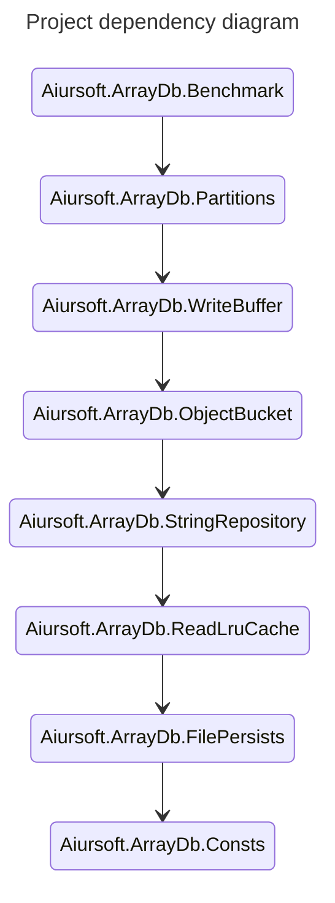

# Aiursoft ArrayDb

[](https://gitlab.aiursoft.cn/aiursoft/arraydb/-/blob/master/LICENSE)
[](https://gitlab.aiursoft.cn/aiursoft/arraydb/-/pipelines)
[](https://gitlab.aiursoft.cn/aiursoft/arraydb/-/pipelines)
[](https://www.nuget.org/packages/Aiursoft.ArrayDb.Partitions/)
[](https://gitlab.aiursoft.cn/aiursoft/arraydb/-/commits/master?ref_type=heads)

Aiursoft ArrayDb is a lightweight, efficient database engine optimized for storing fixed-length data with constant-time indexing performance (O(1)). ArrayDb is ideal for scenarios where fast, reliable storage and access to time-sequenced or resource-utilization data are essential, making it a strong choice for logging, telemetry, and performance tracking use cases.

## Key Design Principles of ArrayDb

Unlike traditional databases, which can struggle with high-frequency data storage requirements, ArrayDb is purpose-built for append-only, fixed-length data storage. It stores entries as continuous, fixed-length data blocks, optimized for minimal read/write operations, ensuring high performance on both SSDs and HDDs.

ArrayDb organizes data into two categories:

1. **Fixed-Length Attributes**: These attributes, such as integers, `DateTime`, and booleans, are stored in a fixed-length array, facilitating fast O(1) access by index.
2. **Variable-Length Attributes**: For data like strings, ArrayDb maintains a separate variable-length array, where each entry contains a pointer in the fixed-length array for fast access.

### Advantages of ArrayDb

1. **High-Speed Access**: ArrayDb stores each element sequentially on disk. By calculating an element’s exact location based on its index, ArrayDb can retrieve or count elements in constant time, O(1).
2. **Optimized Append Performance**: New entries are simply appended, which maintains data consistency and reduces disk fragmentation. This approach also ensures sustained high-speed write performance, even under heavy load.
3. **Efficient Reads**: Reading from ArrayDb only requires a single disk operation to load all columns in an entry, which contrasts with traditional columnar storage that performs multiple reads for each column.

### Limitations

ArrayDb is designed for simplicity and speed but with limited data manipulation:

- **No Structural Modifications**: The structure of stored data cannot be edited after creation.
- **Append-Only**: Supports only appending new entries; no item deletions or mid-array insertions are allowed.
- **Limited Updates**: Modifying variable-length data (e.g., resizing strings) is not supported.

### Best Use Cases for ArrayDb

- **Fixed-Length Data**: Suitable for storing time-series data, such as CPU or memory usage metrics.
- **Time-Based Indexing**: Ideal for sequential logging or telemetry data, where entries are naturally appended and queried by timestamp.

### Read-Write Performance Difference

Large-scale writes are significantly faster than reads because ArrayDb optimizes writes by pre-arranging data (including strings) in memory. This enables sequential, continuous writes to disk, minimizing disk-seeking time to O(1).

In contrast, reads require accessing each string or variable-length attribute individually, creating random access patterns due to potential data fragmentation. As a result, reading incurs a higher O(n) disk-seeking time, where n is the element count. ArrayDb uses an LRU cache to reduce physical disk reads, but in multi-threaded reads, this cache introduces high CPU load.

### Project structure

* The FilePersists provides a service to read and write in actual files.
* The ReadLruCache provides a service to cache the read data, while keeping the API same with FilePersists.
* The StringRepository provides a service to manage the string data.
* The ObjectBucket provides a service to manage the object data, that can save the object array on disk.
* The WriteBuffer is a decorated ObjectBucket that can buffer the write operation to improve the write performance. However, it costs additional read time because it may lock the read when writing.
* The Partitions is a decorated ObjectBucket that can partition the data by a partition key. It can improve the read performance when you need to read data from a specific partition.



For most cases, it's suggested to directly use the `Partitions` module. It provides the best performance and the most features.

If your case is simple and you don't need partition, you can use the `BufferedBucket` module. It provides the best write performance. However, if you don't need the write performance, you can use the `ObjectBucket` module.

```bash
dotnet add package Aiursoft.ArrayDb.Partitions
dotnet add package Aiursoft.ArrayDb.WriteBuffer
dotnet add package Aiursoft.ArrayDb.ObjectBucket
```

## How to use ArrayDb

Unlike MySQL, working as a process, ArrayDb works as a library. You can use ArrayDb in your C# project by adding the `ArrayDb` NuGet package to your project.

```bash
mkdir LearnArrayDb
cd LearnArrayDb
dotnet new console
dotnet add package Aiursoft.ArrayDb.Partitions
```

That's it. Now you have ArrayDb in your project.

### Building the module

You can start using it by creating a new entity with type: `PartitionedBucketEntity<T>`, where T is the partition key type.

Supported property types are:

* `int`
* `bool`
* `string`
* `DateTime`
* `long`
* `float`
* `double`
* `TimeSpan`
* `Guid`

```csharp
using Aiursoft.ArrayDb.ObjectBucket;
using Aiursoft.ArrayDb.Partitions;

public class MyLogItem : PartitionedBucketEntity<string>
{
    [PartitionKey] 
    public string ApplicationName { get; set; } = string.Empty;

    [PartitionKey]
    public override string PartitionId
    {
        get => ApplicationName;
        set => ApplicationName = value;
    }
    
    public DateTime HappenTime { get; set; } = DateTime.UtcNow;

    public string LogMessage { get; set; } = string.Empty;

    public int HttpResponseCode { get; set; }

    public string RequestPath { get; set; } = string.Empty;
    
    public TimeSpan ResponseTime { get; set; }
}
```

Then you can start using ArrayDb by creating a new `PartitionedBucket<T>` instance.

```csharp
var databaseName = "my-db";
var databaseFilePath = "/tmp/my-db";
Directory.CreateDirectory(databaseFilePath);
        
var db = new PartitionedObjectBucket<MyLogItem, string>(databaseName, databaseFilePath);
```

### Writing data

Now you can start using the `db` instance to write some data.

```csharp
// Write to the database.
db.Add(new MyLogItem
{
    ApplicationName = "NextCloud",
    LogMessage = "A user logged in.",
    HttpResponseCode = 200,
    RequestPath = "/account/login",
    ResponseTime = TimeSpan.FromMilliseconds(100)
});

db.Add(new MyLogItem
{
    ApplicationName = "NextCloud",
    LogMessage = "A user logged out.",
    HttpResponseCode = 200,
    RequestPath = "/account/logout",
    ResponseTime = TimeSpan.FromMilliseconds(50)
});

db.Add(new MyLogItem
{
    ApplicationName = "GitLab",
    LogMessage = "A user created a new project.",
    HttpResponseCode = 201,
    RequestPath = "/projects/new",
    ResponseTime = TimeSpan.FromMilliseconds(200)
});

db.Add(new MyLogItem
{
    ApplicationName = "Jellyfin",
    LogMessage = "Server crashed when playing a video.",
    HttpResponseCode = 500,
    RequestPath = "/play/video",
    ResponseTime = TimeSpan.FromMilliseconds(500)
});
```

And you can use bulk write to improve performance.

```csharp
var logs = new List<MyLogItem>();
for (var i = 0; i < 100; i++)
{
    logs.Add(new MyLogItem
    {
        ApplicationName = "HomeAssistant",
        LogMessage = $"A human was detected by the camera {i}.",
        HttpResponseCode = 200,
        RequestPath = $"camera/{i}/detect",
        ResponseTime = TimeSpan.FromMilliseconds(100)
    });
}
// Write 100 items at once.
db.Add(logs.ToArray());
```

Calling `SyncAsync()` is **optional**. It will block current thread and flush the data to the disk. However, if you don't call it, the data will also be archived very soon. Only call this to ensure the data is written to the disk.

```csharp
await db.SyncAsync();
```

### Reading data

You can read data from the database by using the `db` instance. For example, if you want to read from a specific partition and index, you can simply call `Read` with the partition key and index.

```csharp
// Read a specific item.
var specificLog = db.Read(partitionKey: "NextCloud", index: 1);
Console.WriteLine($"[{specificLog.HappenTime}] {specificLog.LogMessage}");
```

Calling `Read` has low performance when you need to read a large amount of data. You can use `ReadBulk` to read bulk data.

```csharp
// Bulk read logs from a specific partition.
var nextCloudLogs = db.ReadBulk(
    partitionKey: "NextCloud",
    indexFrom: 0,
    count: 2);

foreach (var log in nextCloudLogs)
{
    Console.WriteLine($"[{log.HappenTime}] {log.LogMessage}");
}
```

You may also want to know how many logs are there in a specific partition. You can use `Count` to get the count of logs in a specific partition.

```csharp
var nextCloudLogsCount = db.Count("NextCloud");
Console.WriteLine("NextCloud logs count: " + nextCloudLogsCount);
```

You can also read the data as an `IEnumerable` by using `AsEnumerable` with a partition key.

```csharp
var results = db.AsEnumerable(partitionKey: "NextCloud")
    .Where(t => t.HttpResponseCode == 200)
    .OrderBy(t => t.HappenTime)
    .Take(10)
    .ToArray();
```

However, using ArrayDb as an enumerable collection doesn't fully utilize its optimized performance characteristics. Thanks to its fixed-length structure, ArrayDb can quickly locate an element by index without additional overhead. If you need to enumerate through every element in the database, you might want to consider accessing data by index or in bulk where possible to leverage ArrayDb's constant-time (O(1)) access.

If you want to get all data from all partitions, you can use `ReadAll` to get all data.

```csharp
// (Not recommended for large data)
var allLogs = db.ReadAll();
Console.WriteLine("All logs count: " + allLogs.Length);
```

### Deleting data

ArrayDb only support deleting data by partition key. You can use `DeletePartition` to delete all data in a specific partition.

```csharp
// Delete a specific partition.
await db.DeletePartitionAsync("HomeAssistant");
var allLogsAfterDelete = db.ReadAll();
Console.WriteLine("All logs count after delete: " + allLogsAfterDelete.Length);
```

## Best practice

### Avoiding multiple processes accessing the same file!!!

Can I use ArrayDb in multiple processes or instance with the same underlining file?

Answer is: **Absolutely NO**. The underlining file is not thread-safe. You should not use the same file in multiple processes or instances.

So **avoid** doing this:

```csharp
// WRONG CODE, DO NOT COPY!!!
var dbInstanceA = new PartitionedObjectBucket<MyLogItem, string>("my-db", dbPath);
var dbInstanceB = new PartitionedObjectBucket<MyLogItem, string>("my-db", dbPath);

dbInstanceA.Add(new MyLogItem { ApplicationName = "NextCloud", LogMessage = "A user logged in." });
var count = dbInstanceB.Count("NextCloud"); // This will not work as expected!!!
```

If you have multiple services need to access the same data, you should use a server-client model. You can create a server with ArrayDb SDK to manage the data and let the clients access the data through the server.

### Default partition key

In some cases, you don't want to rename the `PartitionId` property to `ApplicationName` in the entity. You can directly add your own property. And use `PartitionId` to access the partition key.

```csharp
// This class inherits from PartitionedBucketEntity<string>, so PartitionId is the partition key.
public class MyLogItem : PartitionedBucketEntity<string>
{
    // Fill your own properties here.
    public string ApplicationName { get; set; } = string.Empty;

    public DateTime HappenTime { get; set; } = DateTime.UtcNow;

    public string LogMessage { get; set; } = string.Empty;

    public int HttpResponseCode { get; set; }

    public string RequestPath { get; set; } = string.Empty;
    
    public TimeSpan ResponseTime { get; set; }
}

var log = new MyLogItem
{
    PartitionId = "NextCloud",
    LogMessage = "A user logged in.",
    HttpResponseCode = 200,
    RequestPath = "/account/login",
    ResponseTime = TimeSpan.FromMilliseconds(100)
};
```

### Rebooting

If your application reboots or crashed, you can simply create a new `PartitionedObjectBucket` instance with the same database name and file path to recover the data.

```csharp
var db = new PartitionedObjectBucket<Log, string>("my-db", dbPath);
for (var i = 0; i < 100; i++)
{
    var sample = new Log
    {
        Message = $"Hello, World! 你好世界 {i}",
        PartitionId = 0
    };
    partitionedService.Add(sample);
}
await partitionedService.SyncAsync(); // Make sure the data is written to the disk.

// Now the application crashes. After rebooting, you can still get the data.

var db = new PartitionedObjectBucket<Log, string>("my-db", dbPath);
foreach (var log in db.AsEnumerable(0))
{
    Console.WriteLine(log.Message);
}
```

However, it is still strongly recommended to keep the `PartitionedObjectBucket` as a singleton in your application. It has inner cache and will improve the performance.

Rebooting the instance will not lose any data before `SyncAsync` is called. But all cache will be lost. So it is better to keep the `PartitionedObjectBucket` instance alive and singleton.

### Using ArrayDb with Dependency Injection

Of course, you can use ArrayDb with Dependency Injection. You can create a singleton service to manage the `PartitionedObjectBucket` instance.

```csharp
services.AddSingleton<PartitionedObjectBucket<MyLogItem, string>>(provider =>
{
    var dbPath = Path.Combine(Directory.GetCurrentDirectory(), "my-db");
    return new PartitionedObjectBucket<MyLogItem, string>("my-db", dbPath);
});
```

Then you can inject the `PartitionedObjectBucket` from the DI container.

## Performance Test Report

ArrayDb has incredible performance. With buffer can insert 1M items in 10.20ms, and can read 1M items in 15.72ms.

Without buffer, it can insert 1M items within 524.191ms, and can read 1M items within 1418.22ms.

Here is a performance test report.

Test platform:

* CPU: 13th Gen Intel(R) Core(TM) i9-13900KS
* RAM: 32GB DDR5 6400MHz
* Disk: Samsung 990 PRO 1TB NVMe SSD
* OS: AnduinOS 1.0.3
* File system: ext4
* .NET: 8.0.110, Release build, Linux-x64

Each test case, warm up 2 times, test 3 times, and get the average time.

| Test Case | Bucket | Buffered Bucket | Buffered Buffered Bucket | Buffered Buffered Buffered Bucket |
|---|---|---|---|---|
| Add 1 time with 1M items | 774.8686 ms (S),  | 10.2093 ms (S),  | 23.7705 ms (S),  | 10.0915 ms (S),  |
| Add 1K items 1K times | 524.191 ms (S), 1278.9293 ms (P) | 12.1467 ms (S), 16.2805 ms (P) | 20.0573 ms (S), 21.4399 ms (P) | 29.8272 ms (S), 37.2894 ms (P) |
| Add 1M times with 1 item | 22956.3927 ms (S), 68387.0663 ms (P) | 166.0826 ms (S), 278.6171 ms (P) | 44.2852 ms (S), 189.1372 ms (P) | 43.4513 ms (S), 220.4332 ms (P) |
| Read 1 time with 1M items | 1418.2269 ms (S),  | 15.72 ms (S),  | 12.7386 ms (S),  | 14.7609 ms (S),  |
| Read 1K items 1K times | 2330.246 ms (S), 2086.1788 ms (P) | 3434.6218 ms (S), 3796.8591 ms (P) | 3748.9203 ms (S), 3131.4449 ms (P) | 3579.8892 ms (S), 3439.7619 ms (P) |
| Read 1 item 1M times | 2900.2711 ms (S), 2984.4894 ms (P) | 3945.6999 ms (S), 4689.5108 ms (P) | 3992.9079 ms (S), 4160.1278 ms (P) | 3962.2668 ms (S), 4134.1648 ms (P) |
| Write 7 read 3 1000 items, 1000 times | 1181.6159 ms (S), 1331.431 ms (P) | 418.5302 ms (S), 1157.6625 ms (P) | 314.2199 ms (S), 53.5181 ms (P) | 971.9621 ms (S), 338.2756 ms (P) |
| Write 3 read 7 1000 items, 1000 times | 2182.6757 ms (S), 2130.797 ms (P) | 1183.3988 ms (S), 776.6431 ms (P) | 670.837 ms (S), 810.9361 ms (P) | 1528.2315 ms (S), 393.8358 ms (P) |

In the table:

* S means single-threaded, like: `for (int i = 0; i < 1000; i++) { db.Add(new MyLogItem()); }`
* P means multi-threaded, like: `Parallel.For(0, 1000, i => { db.Add(new MyLogItem()); });`

## How to contribute

There are many ways to contribute to the project: logging bugs, submitting pull requests, reporting issues, and creating suggestions.

Even if you with push rights on the repository, you should create a personal fork and create feature branches there when you need them. This keeps the main repository clean and your workflow cruft out of sight.

We're also interested in your feedback on the future of this project. You can submit a suggestion or feature request through the issue tracker. To make this process more effective, we're asking that these include more information to help define them more clearly.
